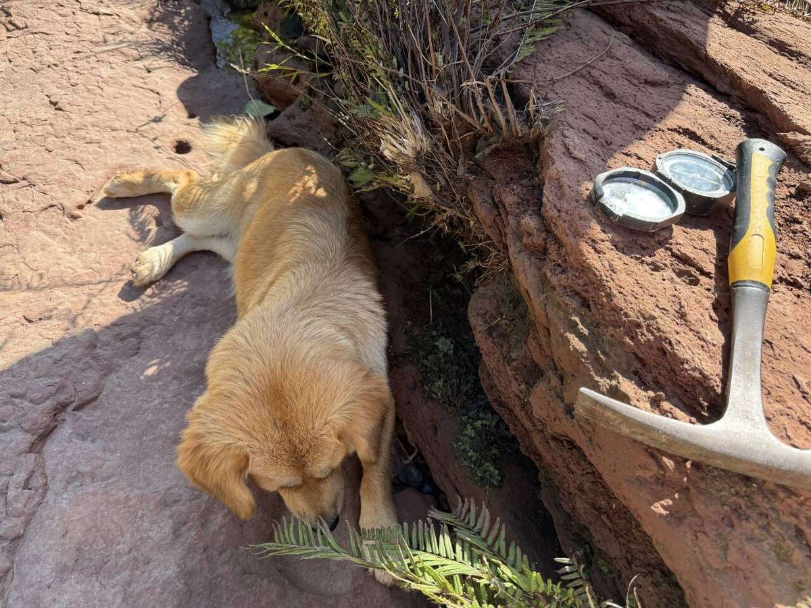
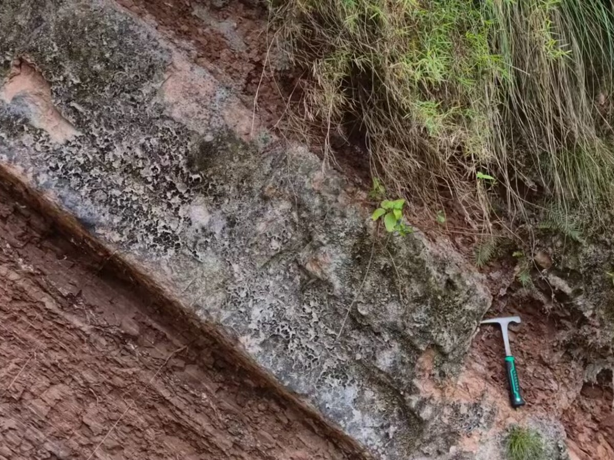
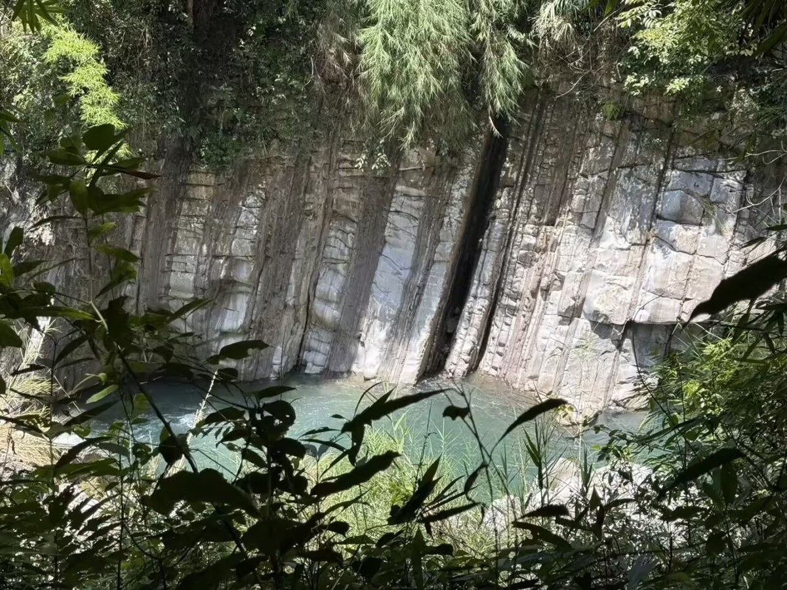
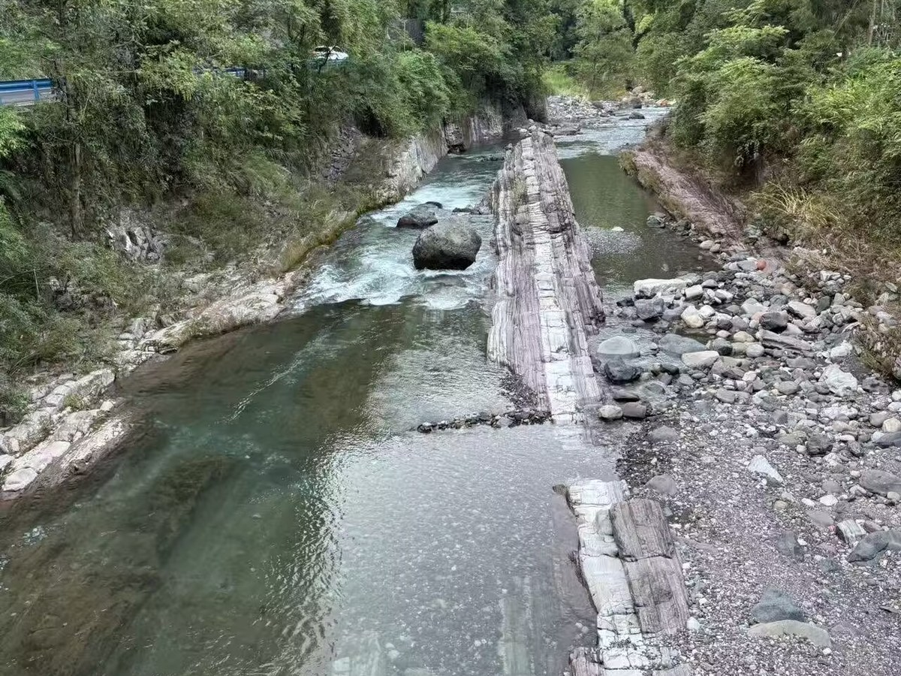

# Hi there 👋

I study geology and use computational tools to explore knowledge, research, and personal productivity.

## 🐍 Contribution Activity

<!-- Generated by .github/workflows/snake.yml. Images become available after the first successful run. -->
<picture>
  <source media="(prefers-color-scheme: dark)" srcset="https://raw.githubusercontent.com/alanfloyd-dev/alanfloyd-dev/output/github-snake-dark.svg" />
  <source media="(prefers-color-scheme: light)" srcset="https://raw.githubusercontent.com/alanfloyd-dev/alanfloyd-dev/output/github-snake.svg" />
  
</picture>

## About

- Studying geology with a long-term interest in paleontology and Earth sciences
- Exploring scientific computing and data-driven research
- Building tools for learning, research, and knowledge management
- Interested in open-source software and reproducible workflows

### Tools

Python · Rust · C# · Vue · FastAPI · MySQL · Linux

  
  
  
  

## 🧰 Tools & Technologies

### Scientific Computing

  
  
  <picture>
    <source media="(prefers-color-scheme: dark)" srcset="https://cdn.simpleicons.org/pandas/F0F6FC" />
    
  </picture>
  

### Development & Systems

  <picture>
    <source media="(prefers-color-scheme: dark)" srcset="https://cdn.simpleicons.org/mysql/F0F6FC" />
    
  </picture>
  
  <picture>
    <source media="(prefers-color-scheme: dark)" srcset="https://cdn.simpleicons.org/rust/F0F6FC" />
    
  </picture>
  
  
  

## Public Projects

Public repositories will be documented here as they become available.

<!--
Project template:

### [Project Name](PROJECT_URL)

A short description of what the project does and why it exists.

`Primary technology` · `Secondary technology`

---

Possible future public projects:

- Alan Floyd Digital Garden
  Personal knowledge management for notes, research reading, writing, and projects.
  Vue 3 · FastAPI · MySQL

- Desktop Todo Widget
  A local-first productivity tool for Windows.
  Rust · Tauri · SQLite · Windows API

Only publish these entries after their repositories are public.
-->

## Links

- [Personal website](https://www.alanfloyd.net)

<!-- Add other links when they are ready to publish.

- [Other links](https://YOUR_LINK_URL)

-->
